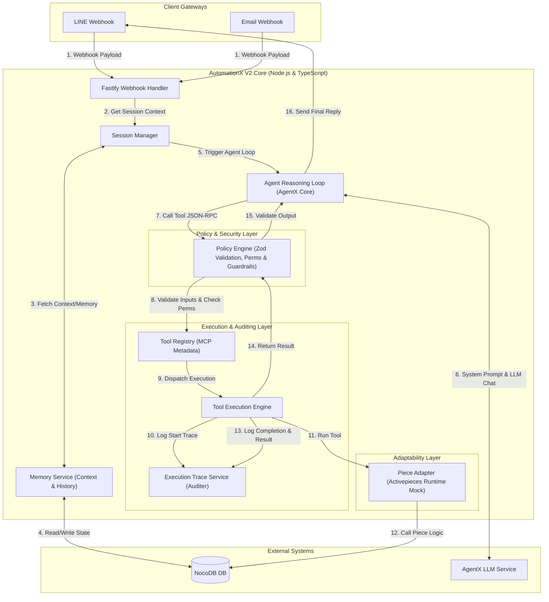

# AutomationX V2 Architecture Blueprint

This document details the system design, folder structures, data flows, and implementation specifications for **AutomationX V2 (Agent-first & MCP)**. This architecture transitions the platform from a rigid no-code execution engine to an LLM-guided agentic engine, while preserving the existing Activepieces integration ecosystem.

---

## 1. V2 Architecture Diagram

The system follows an **Agent-first Loop** powered by **AgentX** as the reasoning core, utilizing **Model Context Protocol (MCP)** for tool communication. Safety, validation, and auditing are handled by the **Policy Layer** and **Execution Trace Layer**.



---

## 2. Folder Structure

The directory layout of the AutomationX V2 engine separates concerns cleanly:

```text
ticket_codebase/
├── architecture.md           # Architecture Blueprint & Data flows (this file)
└── src/
    ├── agent/
    │   └── types.ts          # Agent interface & Reasoning session contracts
    ├── mcp/
    │   └── types.ts          # MCP Server & JSON-RPC messaging contracts
    ├── tools/
    │   └── types.ts          # Tool Registry & Execution contracts
    ├── memory/
    │   └── types.ts          # Memory Service, Conversation history, Caching contracts
    ├── policy/
    │   └── types.ts          # Policy Engine, permissions & safety validation contracts
    ├── execution/
    │   └── types.ts          # Tool Execution Trace, logs & audit trail contracts
    ├── piece-adapter/
    │   └── types.ts          # Activepieces Piece integration adapter & Mock Context contracts
    └── schemas/
        └── validation.ts     # Zod runtime validation schemas for common payloads
```

---

## 3. Data Flow Specification (Step-by-Step)

When a customer sends a message (e.g., *"Cannot log into SSO"*), the system executes the following flow:

### Phase A: Intake & Hydration
1.  **Intake**: Webhook Handler normalizes the raw client payload into a standardized `InboundMessage` shape (extracting `senderId`, `channel`, and `text`).
2.  **Hydration**: Session Manager queries the **Memory Service** to load the conversation thread and the company's profile context (from NocoDB).
3.  **Prompt Assembly**: The Agent Session is instantiated with:
    -   System Prompt (loaded from company context)
    -   Conversation History (memory)
    -   Available Tools (loaded from Tool Registry)

### Phase B: Agentic reasoning & Policy Validation
4.  **LLM Call**: AgentX receives the input, reasons on the problem, and issues a tool call (e.g., `search_project_docs(query: "SSO login issue")`).
5.  **Policy Inspection**: The Tool Call is routed through the **Policy Engine**:
    -   **Permission Check**: Does the tenant company have permission to run `search_project_docs`?
    -   **Input Validation**: Does the payload structure match the tool's input schema (validated using Zod)?
    -   **Guardrails**: Does the query contain unauthorized characters or safety flags?

### Phase C: Tool Execution & Auditing
6.  **Trace Logging**: The **Execution Trace Service** writes an audit entry:
    -   `toolName`: `"search_project_docs"`
    -   `reason`: Agent's rationale (why it called the tool)
    -   `arguments`: `{"query": "SSO login issue"}`
    -   `status`: `"RUNNING"`
7.  **Adapter Invocation**: The **Tool Execution Engine** identifies the tool mapping. Since `search_project_docs` utilizes the `@activepieces/piece-http` piece, the **Piece Adapter** instantiates a mocked `PieceContext` (injecting auth credentials) and executes the Piece action's `run()` method.
8.  **Trace Completion**: The result is captured. The Trace Entry status is updated to `"COMPLETED"` and the result payload is written into the audit log.
9.  **Response Delivery**: The validated results are passed back to the Agent.

### Phase D: Termination
1.  **Resolution**: The Agent analyzes the search results, determines the resolution (e.g., *"Please try clear cache"*), and returns the final text response.
2.  **State Persistence**: The Memory Service updates the conversation logs in NocoDB.
3.  **Outbound Transmission**: The Webhook handler dispatches the message back to the customer's channel (e.g., LINE push API).

---

## 4. Implementation Order

To execute the MVP transition successfully, build the components in the following order:

1.  **Core Types & Zod Schemas**: Solidify contracts (interfaces) and write Zod runtime schemas for inputs/outputs to prevent breaking changes.
2.  **Memory Service & DB Client**: Establish connection to NocoDB and implement Session State loading.
3.  **Piece Adapter & Mocks**: Implement the runtime mocker for Activepieces pieces to run isolated community packages in code.
4.  **Execution Trace Logger**: Set up the auditer service (file-based or NocoDB-backed database logs).
5.  **Tool Registry**: Register custom tools and piece actions, generating MCP tool definitions.
6.  **Policy Engine**: Implement input/output sanitizers and permission checkers.
7.  **MCP Server Handler**: Implement the JSON-RPC SSE/Stdio communication protocol.
8.  **Agent Loop Manager**: Hook everything together with the AgentX API and run integration tests using simulated webhooks.
